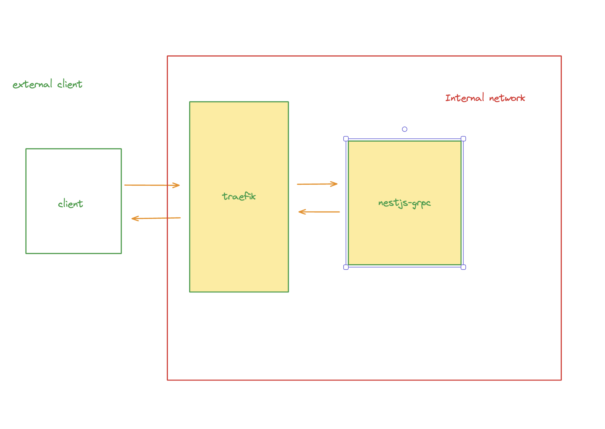

## Implementing gRPC in Nestjs behind a Traefik Proxy

Implement this senario

---

### DevOps checklist

- [ ] dockerize nestjs-grpc and client
- [ ] both Traefik and nestjs-grpc are in the same docker network
- [ ] role of a Traefik is a reverse proxy for gRPC
